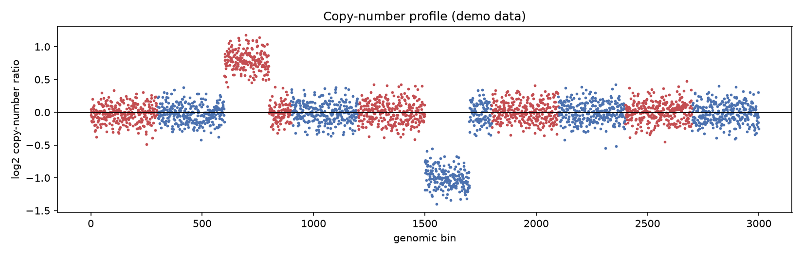

# Cnv Log Ratio Plot

Cancer doesn't just mutate letters — it duplicates and deletes whole chunks of chromosome. The copy-number profile is how you see those large-scale scars.

## Why This Matters

Amplifications of oncogenes and deletions of tumour suppressors drive many cancers, and they are invisible to point-mutation callers. The copy-number log-ratio — coverage in the tumour versus a normal — plotted along the genome makes gains and losses jump out as bands sitting above or below zero.

## How It Works

1. Bin the genome and compute tumour/normal coverage ratio per bin.
2. Take the log2 of each ratio.
3. Plot along genomic position; segments above 0 are gains, below are losses.

## What the Demo Shows



The demo plants one amplification and one deletion. A clear band rises above zero (the amplified region) and another drops below (the deletion) — exactly the events you would report as candidate driver copy-number changes.

## Run It

```bash
pip install -r requirements.txt
python demo.py
```

> Demonstrated on synthetic data, so it's fully reproducible with no external downloads.
